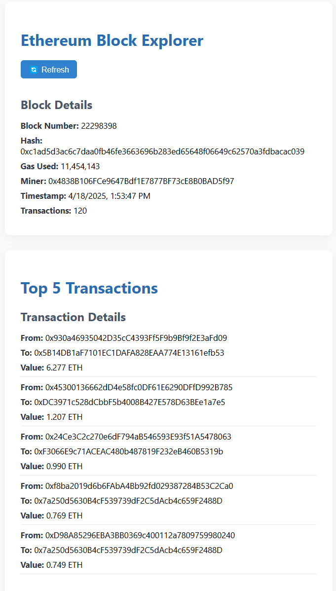

# 🧱 Ethereum Block Explorer

A simple and clean Ethereum block explorer built with React + Alchemy SDK.
> ℹ️ This project was originally based on coursework from [Alchemy’s Ethereum Bootcamp Week 3](https://university.alchemy.com/course/ethereum/md/63f8fb47716397000257645a). The README and implementation have been customized to reflect my MVP and development learnings.

## 🔍 Features

- Shows latest block data:
  - Block number
  - Hash
  - Gas Used
  - Miner 
  - Timestamp
  - Transactions
- Displays top 5 highest-value transactions in real-time
- Uses Alchemy’s SDK and ethers-powered utilities
- Styled for clarity and accessibility

## 🖼️ Preview

Here’s a preview of the Ethereum Block Explorer:

## ⚙️ Tech Stack

- React (Frontend)
- [Alchemy SDK](https://docs.alchemy.com/reference/api-overview?)
- JavaScript (ES6)
- HTML/CSS