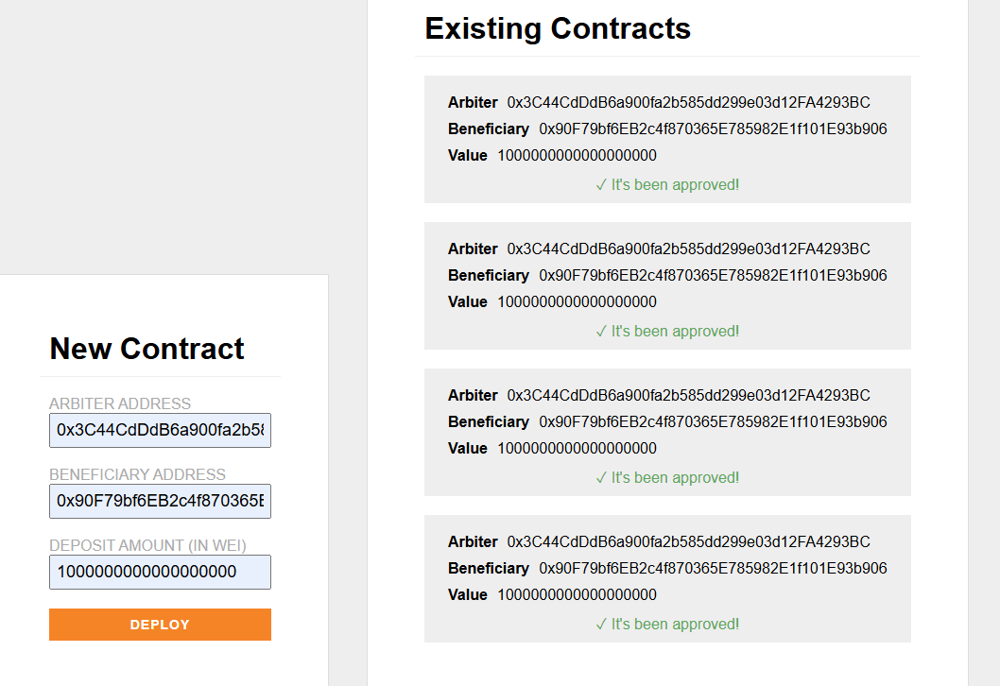

# 🧾 Decentralized Escrow Application

A full-stack Ethereum dApp that simulates an escrow contract between a depositor, arbiter, and beneficiary using smart contracts, React, and Hardhat.
> ℹ️ This project was originally cloned from [alchemyplatform/escrow-hardhat](https://github.com/alchemyplatform/escrow-hardhat). The README and implementation have been customized based on my development experience and learning.

## 🧠 What I Built

This project demonstrates a working decentralized escrow flow:

- 🏗️ Deploy escrow contracts locally with Hardhat
- 👤 Depositor funds the contract
- 👨‍⚖️ Arbiter has the sole power to approve fund release
- 💰 Beneficiary receives ETH once approved
- 🌐 React frontend with MetaMask integration and contract event updates

## ⚙️ Tech Stack

- [Solidity](https://docs.soliditylang.org/)
- [Hardhat](https://hardhat.org/)
- [React](https://reactjs.org/)
- [ethers.js](https://docs.ethers.org/)
- [MetaMask](https://metamask.io/)
---

## 🚀 Getting Started

### 🛠️ Step 1: Clone the Repo

```bash
git clone https://github.com/alchemyplatform/escrow-hardhat.git
cd escrow-hardhat
```

### 📦 Step 2: Install Dependencies

```bash
npm install
cd app
npm install
```

### 🧪 Step 3: Start Local Blockchain (Hardhat Node)

```bash
cd ..
npx hardhat node
```

### 💻 Step 4: Run the React Frontend

```bash
cd app
npm start
```

Then visit: [http://localhost:3000](http://localhost:3000)

---

## 🧪 How to Use

### 🔌 Connect MetaMask

1. Add a custom network in MetaMask:
   - RPC: `http://127.0.0.1:8545`
   - Chain ID: `31337`

2. Import one of the test accounts printed by Hardhat into MetaMask.

### ✍️ Deploy an Escrow Contract

- Fill in:
  - Arbiter address
  - Beneficiary address
  - Deposit amount (in **wei**)
- Click **Deploy** and confirm in MetaMask.

### 🔐 Approve the Escrow

- Switch to the **arbiter** account
- Click **Approve** on the deployed contract card
- Confirm the transaction in MetaMask
- The UI will update with ✅ "It’s been approved!"

---

## 📸 Screenshot



## 💡 Features To Add

- [ ] Deploy to Sepolia testnet
- [ ] UI validation for form inputs
- [ ] Display ETH balance of connected wallet
- [ ] Persist contracts across reloads (localStorage or backend)


## 📜 License

MIT — Feel free to clone or edit

